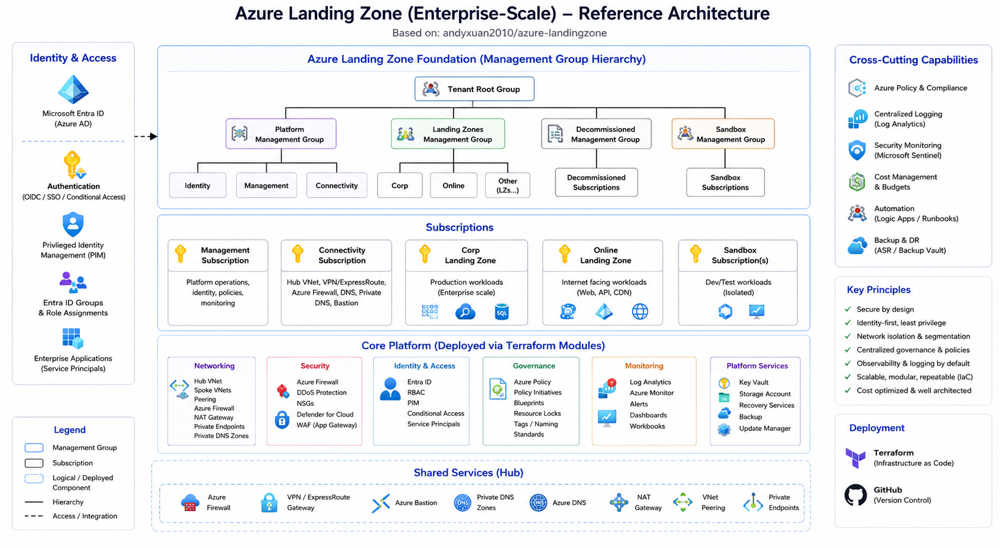

# Architecture — Enterprise AI Chatbot on Azure

## 1. Executive Summary

This repository implements an enterprise document-grounded Retrieval-Augmented Generation (RAG) chatbot on Azure.

The solution lets users ask questions through a browser UI. The backend application retrieves relevant enterprise-controlled content from Azure AI Search, uses Azure OpenAI to generate a grounded answer, validates that citations refer to real retrieved evidence, and returns the answer with citations and source previews.

The runtime is intentionally constrained: it does not perform public internet search. It answers only from content that has already been ingested, chunked, embedded, and indexed into Azure AI Search.

This repository is a workload repository, not a full Azure landing zone. It provisions the app-specific Azure resources and reuses shared platform services from an existing landing-zone deployment.

## 2. Architecture Diagram



## 3. Repository Scope

### 3.1 What This Repository Is

This repository is the workload deployment and application repository for the enterprise AI chatbot.

It contains:

- Terraform root configuration for the chatbot workload.
- Environment-specific Terraform configuration for dev, sandbox, and production.
- Python web application code under `app/api`.
- Repo-root App Service bootstrapping wrappers.
- Document ingestion script under `scripts/ingest_docs.py`.
- CI/CD pipeline definitions for GitHub Actions and Azure DevOps.
- Documentation and architecture assets.

### 3.2 What This Repository Is Not

This repository is not a full landing-zone implementation.

It should not create duplicate shared platform services that already exist in the landing zone. Shared services are intentionally looked up through Terraform data sources. If a required shared service is missing, the correct behavior is for `terraform plan` to fail rather than silently creating unmanaged duplicates.

## 4. Provisioned Resources

The workload repository provisions the app-specific resources required by the chatbot.

| Resource | Responsibility |
|---|---|
| Application resource group | Logical container for chatbot workload resources when `resource_group_name` is supplied. |
| Linux App Service Plan | Compute plan for the Linux Python App Service. |
| Linux Python App Service | Hosts the browser UI and `/chat` API. |
| Microsoft Entra app registration | Supports App Service authentication and identity integration. |
| RAG storage container | Stores ingested source documents in the shared landing-zone Storage Account. |
| Optional Azure AI Search query key | Supports query access where key-based access is used. |
| Optional Azure OpenAI deployments | Creates chat and embedding deployments when the shared OpenAI account is looked up and deployment creation is enabled. |

## 5. Reused Landing-Zone Resources

The workload reuses shared platform resources from the sibling landing-zone deployment.

| Shared Resource | Responsibility |
|---|---|
| Shared resource group | Existing container for platform-level shared services. |
| Storage account | Stores source documents, source previews, application artifacts, or supporting files. |
| Key Vault | Stores secrets, keys, and sensitive configuration. |
| Log Analytics workspace | Centralized diagnostics and operational telemetry. |
| Azure OpenAI account | Provides chat and embedding model deployments. |
| Azure AI Service account | Shared AI service available for future extension scenarios. |
| Azure AI Search service | Stores indexed document chunks, metadata, and vectors for retrieval. |

This split is deliberate. The workload owns the chatbot. The landing zone owns shared platform services, governance, monitoring, and reusable AI infrastructure.

## 6. Logical Architecture Layers

### 6.1 User Interaction Layer

The user interaction layer is the browser-based chat experience.

Responsibilities:

- Render the chat UI.
- Submit user questions to the backend `/chat` endpoint.
- Send optional chat history to support follow-up question rewriting.
- Display the generated answer.
- Display citations, source previews, metadata, and highlighted matching terms.
- Avoid direct calls to Azure OpenAI, Azure AI Search, Key Vault, or Storage.

The browser must not be trusted as an authorization boundary. Enforcement belongs in the backend.

### 6.2 Application Orchestration Layer

Azure App Service hosts the Linux Python application and acts as the central orchestrator.

Responsibilities:

- Serve the web UI.
- Expose the `/chat` API.
- Integrate with Microsoft Entra ID when App Service authentication is enabled.
- Rewrite vague or follow-up questions into standalone retrieval questions.
- Generate expanded retrieval queries.
- Request embeddings from Azure OpenAI.
- Run hybrid retrieval against Azure AI Search.
- Apply access filters and optional metadata filters.
- Deduplicate retrieval candidates.
- Optionally rerank candidates.
- Build the grounded answer-generation request.
- Validate returned citations.
- Return conservative refusals when retrieval evidence is weak or citations are invalid.
- Emit application logs and telemetry.

This layer is the policy enforcement and orchestration point of the system.

### 6.3 Retrieval Layer

Azure AI Search provides the retrieval layer.

Responsibilities:

- Store searchable document chunks.
- Store vector embeddings.
- Store metadata fields for filtering and source inspection.
- Execute keyword/full-text search.
- Execute vector search.
- Merge keyword and vector results through hybrid retrieval.
- Support optional semantic configuration.
- Return evidence chunks to the application.

Azure AI Search retrieves evidence; it does not generate final answers.

### 6.4 Generation Layer

Azure OpenAI provides model capabilities.

Responsibilities:

- Generate embeddings for retrieval queries.
- Rewrite follow-up questions.
- Generate expanded retrieval queries.
- Rerank retrieved candidate chunks when enabled.
- Generate the final grounded answer from retrieved evidence.
- Return structured JSON containing the answer, citations, grounded status, and refusal reason.

The model output is not accepted blindly. The application validates citations before returning the answer to the user.

### 6.5 Platform and Governance Layer

The platform layer consists of shared landing-zone services such as Key Vault, Log Analytics, Storage Account, Azure OpenAI, Azure AI Service, and Azure AI Search.

Responsibilities:

- Centralize secrets and sensitive configuration.
- Centralize logging and monitoring.
- Provide shared AI and search services.
- Provide durable document storage.
- Support enterprise governance and environment consistency.

## 7. Runtime Flow

The runtime flow is executed when a user asks a question.

### Step 1 — User submits a question

The browser sends a question to the `/chat` endpoint. The request may include:

- Current user question.
- Chat history.
- User groups.
- Metadata filters.

Example request shape:

```json
{
  "question": "How do I configure vector search?",
  "user_groups": ["default"],
  "chat_history": [
    {
      "role": "user",
      "content": "Tell me about Azure AI Search."
    },
    {
      "role": "assistant",
      "content": "Azure AI Search supports keyword, vector, hybrid, and semantic search."
    }
  ],
  "filters": {
    "source_path": "retrieval-augmented-generation-overview.md",
    "document_title": "Retrieval augmented generation",
    "section_heading": "Indexing strategy",
    "product_service": "search",
    "document_date": "2025-09-01",
    "document_version": "2025-09-01",
    "url": "https://learn.microsoft.com/...",
    "access_group": "default"
  }
}
```

### Step 2 — Identity context is established

If App Service authentication is enabled, Microsoft Entra ID authenticates the user.

Do not confuse these three controls:

| Control | Meaning |
|---|---|
| Authentication | Confirms who the user is. |
| Authorization | Determines which content the user is allowed to retrieve. |
| Grounding | Determines whether the answer is supported by retrieved evidence. |

Authentication alone is insufficient. Retrieval authorization still needs to be enforced by the backend.

### Step 3 — Query rewrite and expansion

The app rewrites vague or follow-up questions into standalone retrieval questions. It can also generate multiple expanded retrieval queries to improve recall.

Example:

```text
User follow-up:
"How do I configure that?"

Standalone retrieval question:
"How do I configure vector search in Azure AI Search?"
```

Relevant tuning variables:

| Setting | Default | Purpose |
|---|---:|---|
| `QUERY_REWRITE_ENABLED` | `true` | Enables standalone question rewriting and multi-query expansion. |
| `QUERY_EXPANSION_COUNT` | `3` | Maximum number of alternate retrieval queries generated before search. |
| `QUERY_REWRITE_HISTORY_MESSAGES` | `6` | Number of recent chat messages used to rewrite follow-up questions. |

### Step 4 — Embeddings are generated

The app sends retrieval queries to the Azure OpenAI embedding deployment. Each query embedding is then used for vector retrieval.

Relevant settings:

| Setting | Purpose |
|---|---|
| `AZURE_OPENAI_ENDPOINT` | Azure OpenAI endpoint. |
| `AZURE_OPENAI_EMBED_DEPLOYMENT` | Embedding model deployment name. |

### Step 5 — Hybrid retrieval runs in Azure AI Search

The app queries Azure AI Search using both keyword search and vector search.

Retrieval includes:

- Keyword/full-text search using `search_text`.
- Vector retrieval using `VectorizedQuery`.
- Result merging through reciprocal rank fusion.
- Optional semantic configuration.
- Metadata and access filtering.

Relevant tuning variables:

| Setting | Default | Purpose |
|---|---:|---|
| `HYBRID_SEARCH_TOP` | `5` | Number of hybrid results used when reranking is disabled, and fallback count if reranking fails. |
| `HYBRID_VECTOR_K` | `8` | Number of vector neighbors requested before AI Search fuses results. |
| `AZURE_SEARCH_SEMANTIC_CONFIGURATION` | empty | Optional Azure AI Search semantic configuration name. |
| `AZURE_SEARCH_INDEX` | environment-specific | Target search index. |

### Step 6 — Access and metadata filters are applied

The application applies access filters and optional metadata filters.

Supported metadata includes:

| Field | Source |
|---|---|
| `source_path` | Relative file path under `DOCS_PATH`. |
| `document_title` | Title metadata, first H1, or file name. |
| `section_heading` | Nearest heading inside the chunk. |
| `product_service` | `INGEST_PRODUCT_SERVICE`, `ms.service`, `service`, or folder name. |
| `document_date` | `ms.date` or `date` metadata. |
| `document_version` | `ms.version` or `version` metadata. |
| `url` | `url`, `canonical_url`, `ms.authoring-url`, or `DOCS_BASE_URL` plus path. |
| `access_group` | `INGEST_ACCESS_GROUP`, default `default`. |

The `access_group` field is the most security-relevant metadata field. If retrieval returns unauthorized chunks, the language model can leak restricted information while still appearing grounded.

### Step 7 — Candidates are deduplicated

Expanded retrieval queries can return overlapping evidence. The application deduplicates candidates so the same chunk does not dominate the answer context.

### Step 8 — Optional reranking is applied

When enabled, Azure OpenAI reranks a broader hybrid candidate set before final answer generation.

Relevant tuning variables:

| Setting | Default | Purpose |
|---|---:|---|
| `RERANK_ENABLED` | `true` | Enables second-stage LLM reranking. |
| `RERANK_CANDIDATE_TOP` | `12` | Number of hybrid candidates retrieved before reranking. |
| `RERANK_TOP` | `5` | Number of reranked chunks sent to answer generation. |
| `RERANK_CONTENT_CHARS` | `1200` | Maximum characters per candidate sent to the reranker. |

Reranking improves precision but adds one extra chat completion call per question. For lower latency or lower demo cost, disable reranking.

### Step 9 — Grounded answer generation is performed

The app sends selected evidence chunks to Azure OpenAI and requests a structured grounded answer.

Expected answer contract:

| Field | Meaning |
|---|---|
| `answer` | Final answer text. |
| `citations` | Evidence IDs used to support the answer. |
| `grounded` | Whether the model claims the answer is grounded in provided evidence. |
| `refusal_reason` | Reason for refusal when evidence is insufficient. |

### Step 10 — Citations are validated

The app verifies that returned citations reference real retrieved evidence IDs.

Relevant setting:

| Setting | Default | Purpose |
|---|---:|---|
| `MIN_GROUNDED_CITATIONS` | `1` | Minimum verified evidence citations required before returning an answer. |

If citations are missing or evidence is weak, the application returns a conservative refusal. This is correct behavior. A plausible answer without verified evidence is not acceptable in this architecture.

### Step 11 — Browser renders the response

The browser renders:

- Final answer.
- Citations.
- Clickable source previews.
- Metadata.
- Highlighted matching terms.

## 8. Document Ingestion Architecture

The ingestion flow prepares enterprise documents for retrieval.

### 8.1 Supported Inputs

The repository ingestion flow reads:

- `.md`
- `.txt`
- `.pdf`

The architecture diagram may show DOCX as a possible document source. Treat DOCX as a future extension or preprocessing input unless the ingestion script is extended to parse `.docx` directly.

### 8.2 Ingestion Script

The ingestion script is:

```text
scripts/ingest_docs.py
```

It recursively reads files from `DOCS_PATH`, uploads source files to Blob Storage, chunks text, creates embeddings, and writes searchable records to Azure AI Search.

### 8.3 Required Environment Variables

```powershell
$env:AZURE_OPENAI_ENDPOINT="https://<openai>.openai.azure.com/"
$env:AZURE_OPENAI_EMBED_DEPLOYMENT="embedding"
$env:AZURE_SEARCH_ENDPOINT="https://<search>.search.windows.net"
$env:AZURE_SEARCH_INDEX="enterprise-docs"
$env:STORAGE_ACCOUNT_NAME="<storage-account>"
$env:STORAGE_CONTAINER_NAME="documents"
$env:DOCS_PATH="path\to\docs"
```

For sandbox key-based ingestion:

```powershell
$env:AZURE_SEARCH_ADMIN_KEY=(az search admin-key show --service-name <search-service> --resource-group <resource-group> --query primaryKey -o tsv)
$env:AZURE_STORAGE_ACCOUNT_KEY=(az storage account keys list --account-name <storage-account> --resource-group <resource-group> --query '[0].value' -o tsv)
$env:AZURE_OPENAI_API_KEY=(az cognitiveservices account keys list --name <openai-account> --resource-group <resource-group> --query key1 -o tsv)
python scripts\ingest_docs.py
```

### 8.4 Ingestion Steps

1. Read source files from `DOCS_PATH`.
2. Upload source files to Blob Storage.
3. Extract text.
4. Preserve Markdown structure where applicable.
5. Split content into chunks.
6. Attach metadata to each chunk.
7. Generate embeddings through Azure OpenAI.
8. Write searchable records into Azure AI Search.
9. Validate that records can be retrieved by keyword and vector search.

### 8.5 Search Index Metadata

Each search record should include fields required for filtering and source inspection.

| Metadata Field | Purpose |
|---|---|
| `source_path` | Identifies the original source path. |
| `document_title` | Provides human-readable document name. |
| `section_heading` | Helps users understand where evidence came from. |
| `product_service` | Enables service-specific filtering. |
| `document_date` | Supports freshness assessment. |
| `document_version` | Supports version-specific retrieval. |
| `url` | Links to the canonical source when available. |
| `access_group` | Supports retrieval authorization. |

If metadata fields were added after index creation, recreate or migrate the index. Do not assume old index schemas are compatible with new retrieval filters.

## 9. Terraform Architecture

### 9.1 Root Files

| File or Folder | Purpose |
|---|---|
| `main.tf` | Root resource composition. |
| `data.tf` | Shared landing-zone data lookups. |
| `variables.tf` | Root input variables. |
| `outputs.tf` | Root outputs. |
| `providers.tf` | Terraform provider configuration. |
| `versions.tf` | Terraform and provider version constraints. |
| `environments/dev` | Dev backend and tfvars. |
| `environments/sandbox` | Sandbox backend and tfvars. |
| `environments/prod` | Production backend and tfvars. |

### 9.2 Important Workload Inputs

| Input | Purpose |
|---|---|
| `workload` | Workload name used for naming, tags, and module inputs. |
| `environment` | Target environment. |
| `resource_group_name` | Optional application resource group override. |
| `app_service_plan_name` | Optional App Service Plan name override. |
| `app_service_name` | Optional globally unique App Service name override. |
| `app_registration_display_name` | Optional Entra app registration display name override. |
| `app_service_python_version` | Python runtime version. |
| `app_service_enable_auth` | Enables App Service authentication wiring. |
| `azure_openai_chat_deployment` | Chat deployment name exposed to the app. |
| `azure_openai_embed_deployment` | Embedding deployment name exposed to the app. |
| `azure_search_index` | Search index name exposed to the app. |

### 9.3 Important Landing-Zone Lookup Inputs

| Input | Purpose |
|---|---|
| `landingzone_resource_group_name` | Existing landing-zone resource group. |
| `landingzone_storage_account_name` | Existing landing-zone Storage Account. |
| `landingzone_key_vault_name` | Existing landing-zone Key Vault. |
| `landingzone_log_analytics_name` | Existing landing-zone Log Analytics workspace. |
| `landingzone_openai_name` | Existing Azure OpenAI account. |
| `landingzone_azure_ai_service_name` | Existing Azure AI Service account. |
| `landingzone_azure_ai_search_name` | Existing Azure AI Search service. |
| `landingzone_azure_ai_search_enabled` | Enables Azure AI Search lookup per environment. |

### 9.4 Environment Strategy

| Environment | Purpose | Notes |
|---|---|---|
| Dev | Engineering validation | Uses shared landing-zone dev resources. |
| Sandbox | Integration and demo | Uses sandbox shared resources and enables Azure AI Search lookup. |
| Prod | Production | Placeholder values must be replaced before real deployment. |

Production deployment must be blocked until production tfvars contain real resource names, real identity settings, explicit network decisions, and monitoring configuration.

## 10. CI/CD Architecture

### 10.1 GitHub Actions

GitHub Actions is defined under:

```text
.github/workflows/terraform.yml
```

Expected behavior:

- Validate and plan for dev.
- Support manual apply for dev through `workflow_dispatch`.
- Publish to a stage repository.
- Mirror to an Azure DevOps repository.

Important secrets:

| Secret | Purpose |
|---|---|
| `AZURE_CLIENT_ID` | Azure service principal client ID. |
| `AZURE_CLIENT_SECRET` | Azure service principal secret. |
| `AZURE_TENANT_ID` | Azure tenant ID. |
| `AZURE_SUBSCRIPTION_ID` | Azure subscription ID. |
| `AZURE_ADO_PAT2` | Azure DevOps PAT. |
| `INFRACOST_API_KEY` | Infracost integration. |
| `STAGE_REPO_URL` | Stage repository URL. |
| `STAGE_REPO_TOKEN` | Stage repository token. |
| `ADO_REPO_URL` | Azure DevOps repository URL. |
| `ADO_REPO_PAT` | Azure DevOps repository PAT. |

Production recommendation: replace long-lived client secrets with workload identity federation or OIDC where possible.

### 10.2 Azure DevOps

Azure DevOps pipeline configuration is defined in:

```text
azure-pipelines.yml
```

Expected behavior:

- Validate repository changes on `main`, `dev`, `sandbox`, and `sbx`.
- Run sandbox plan/apply for `main`, `sandbox`, and `sbx`.
- Run dev plan/apply for `main` and `dev`.

The pipeline expects shared template repositories and Azure service connections to already exist.

## 11. Security Architecture

### 11.1 Identity and Access

Minimum requirements:

- Enforce App Service authentication for restricted deployments.
- Configure Microsoft Entra app assignment when access must be restricted to selected users or groups.
- Derive or validate user group context server-side.
- Apply retrieval filters before answer generation.
- Never rely on the browser for authorization enforcement.

### 11.2 Retrieval Authorization

Retrieval authorization is the critical security boundary in this architecture.

Bad design:

```text
Authenticate user -> retrieve all documents -> trust model to avoid sensitive content
```

Correct design:

```text
Authenticate user -> determine authorized groups -> filter retrieval -> generate answer only from authorized evidence
```

Each indexed chunk should carry an access group or equivalent ACL metadata. Search queries must filter results to authorized groups.

### 11.3 Secrets Management

Key Vault should store secrets and sensitive configuration.

Production direction:

- Use managed identity where supported.
- Store remaining secrets in Key Vault.
- Rotate keys.
- Avoid printing secrets or environment dumps in logs.
- Avoid long-lived credentials in repository files and pipeline YAML.
- Prefer OIDC/federated credentials over client secrets for CI/CD.

### 11.4 Network Security

The diagram is a logical architecture. It does not prove that private endpoints, VNet integration, firewall routing, or private DNS are implemented.

For production, explicitly document:

- App Service VNet integration.
- Private Endpoint requirements for Azure OpenAI, Azure AI Search, Storage, and Key Vault.
- Public network access setting for each shared service.
- Private DNS zone ownership and resolution.
- Outbound routing from App Service.
- Firewall inspection requirements.
- Diagnostic logging for denied connections.

Do not claim the solution is private or isolated unless those controls are implemented and tested.

### 11.5 Prompt Injection Control

Retrieved content is untrusted input. A malicious document can try to override the system prompt or leak data.

Required controls:

- Treat retrieved document text as evidence, not instructions.
- Keep system/developer instructions separate from retrieval content.
- Do not allow retrieved content to override policy.
- Limit model tool/function access.
- Validate citations.
- Refuse unsupported answers.
- Log suspicious patterns according to privacy policy.

## 12. Observability and Reliability

### 12.1 Failure Handling

| Failure | Expected Behavior |
|---|---|
| Azure AI Search unavailable | Return controlled retrieval error. Do not answer from model memory. |
| Azure OpenAI embedding call fails | Return controlled retrieval failure. |
| Azure OpenAI answer generation fails | Return controlled generation failure. |
| Reranking fails | Fall back to non-reranked hybrid results if configured. |
| No relevant evidence found | Return conservative refusal. |
| Citations missing or invalid | Refuse or return guarded response. |
| Index schema mismatch | Fail ingestion and report schema issue. |
| Missing shared resource | Terraform plan fails. |
| Authentication misconfiguration | Fail closed for restricted deployments. |

The correct reliability and security bias is fail closed for authentication, authorization, retrieval, and grounding failures.

### 12.2 Recommended Telemetry

Track at minimum:

- Request count.
- Request latency.
- Authentication failures.
- Search latency.
- Search error count.
- Embedding latency.
- Chat completion latency.
- Reranking latency.
- Retrieved chunk count.
- Reranked chunk count.
- Verified citation count.
- Refusal rate.
- No-evidence rate.
- Invalid-citation rate.
- Token usage.
- Cost indicators.
- Ingestion success/failure count.
- Indexing duration.
- Document count.
- Chunk count.

Logs must avoid storing sensitive prompts, retrieved content, secrets, or personally identifiable information unless there is an explicit privacy, retention, and access-control policy.

### 12.3 Recommended Alerts

| Alert | Trigger |
|---|---|
| High `/chat` error rate | Chat API failures exceed threshold. |
| Search failure spike | Azure AI Search errors exceed threshold. |
| OpenAI failure spike | Azure OpenAI errors exceed threshold. |
| High latency | P95 latency exceeds target. |
| Invalid citation spike | Citation validation failures exceed baseline. |
| Refusal spike | Refusal rate exceeds expected baseline. |
| Ingestion failure | Ingestion job fails. |
| Stale index | Indexed document version or date is stale. |

## 13. Cost Architecture

Main cost drivers:

| Component | Cost Driver |
|---|---|
| App Service Plan | SKU and instance count. |
| Azure OpenAI chat deployment | Tokens for query rewrite, rerank, and answer generation. |
| Azure OpenAI embedding deployment | Number and size of queries and document chunks embedded. |
| Azure AI Search | SKU, replicas, partitions, vector index size, and query volume. |
| Storage Account | Stored documents, previews, and transactions. |
| Log Analytics | Ingested log volume and retention. |

Cost levers:

- Disable reranking for demos or low-cost environments.
- Reduce `QUERY_EXPANSION_COUNT`.
- Reduce `RERANK_CANDIDATE_TOP`.
- Reduce `RERANK_CONTENT_CHARS`.
- Tune chunk size and overlap.
- Avoid verbose logging of full prompts and retrieved evidence.
- Use environment-appropriate Azure AI Search SKUs.
- Separate dev, sandbox, and production scaling policies.

## 14. Production Readiness Checklist

Before production deployment, verify:

- App Service authentication is enabled and tested.
- Entra app assignment is configured if access is restricted.
- Retrieval authorization is enforced server-side.
- `access_group` metadata is assigned consistently.
- Azure AI Search index schema is reviewed and versioned.
- Source documents are approved and classified before ingestion.
- Key Vault stores required secrets.
- Managed identity is used where possible.
- Public network access decisions are explicit for each service.
- Private endpoint and DNS design are documented if required.
- Logs and metrics flow to Log Analytics.
- Alerts are configured.
- Reranking cost impact is understood.
- Token and cost monitoring are implemented.
- Ingestion is repeatable.
- Index rebuild process is tested.
- Citation validation is enabled.
- Unsupported answers result in refusal, not hallucination.
- Production tfvars contain real values, not placeholders.
- CI/CD approval gates exist for production.
- Rollback exists for both infrastructure and application code.

## 15. Current Gaps and Recommendations

### 15.1 Clarify DOCX Support

The repository indicates `.md`, `.txt`, and `.pdf` ingestion. If DOCX appears in architecture diagrams, either implement DOCX parsing or label DOCX as a future extension.

### 15.2 Replace Sandbox Key-Based Ingestion

The sandbox ingestion process uses keys for Azure AI Search, Storage, and Azure OpenAI. That is tolerable for sandbox, but production should move toward managed identity and RBAC where supported.

### 15.3 Define Private Networking

The current architecture is logical. If this is for enterprise production, add a dedicated network architecture section covering VNet integration, Private Endpoints, private DNS zones, outbound routing, and public network access restrictions.

### 15.4 Add Index Lifecycle Management

Define index creation, migration, rebuild, rollback, and schema versioning. RAG quality will degrade or break if ingestion code and index schema drift.

### 15.5 Add RAG Evaluation

Add an evaluation harness with:

- Golden questions.
- Expected source citations.
- Retrieval-quality metrics.
- Answer-quality scoring.
- Regression tests in CI/CD.

### 15.6 Add Content Governance

Define who can upload documents, approve sources, assign access groups, retire stale documents, and audit citation usage.

## 16. Glossary

| Term | Meaning |
|---|---|
| RAG | Retrieval-Augmented Generation. External knowledge is retrieved and supplied to a language model before answer generation. |
| Chunk | A smaller section of source text stored as a searchable record. |
| Embedding | Vector representation of text used for semantic similarity search. |
| Hybrid Search | Retrieval combining keyword search and vector search. |
| Reranking | Second-stage relevance ordering of retrieved candidates. |
| Grounded Answer | Answer supported by retrieved evidence. |
| Citation Validation | Application-side verification that model citations reference real retrieved evidence IDs. |
| Landing Zone | Shared enterprise platform foundation for governance, identity, monitoring, networking, and reusable services. |
| App Service | Azure managed web app hosting service used to run the Python chatbot application. |

## 17. Source Files and References

Repository URL:

```text
https://github.com/andyxuan2010/enterprise-ai-chatbot
```

Key files and folders:

```text
README.md
main.tf
data.tf
variables.tf
outputs.tf
providers.tf
versions.tf
app/api
scripts/ingest_docs.py
startup.sh
requirements.txt
.github/workflows/terraform.yml
azure-pipelines.yml
environments/dev
environments/sandbox
environments/prod
docs/current-deployment-architecture.md
docs/images/enterprise-ai-chatbot-architecture.svg
```
